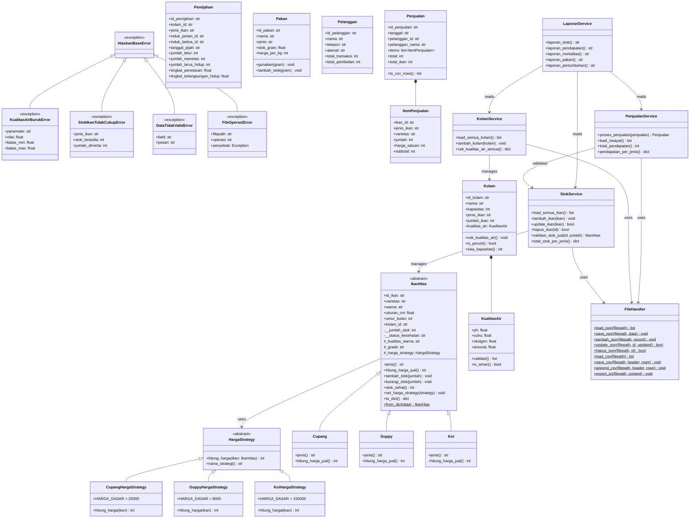

# UML Class Diagram — Hiaskan

## Keterangan Notasi
- `<<abstract>>` — kelas abstrak, tidak bisa diinstansiasi langsung
- `<<exception>>` — kelas exception custom
- `-` private, `#` protected, `+` public
- `*` abstract method
- `$` static/class method
- `<|--` inheritance (is-a)
- `-->` dependency/uses
- `*--` composition (has-a, lifecycle terikat)
